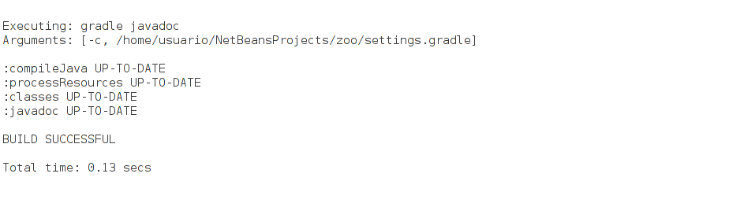
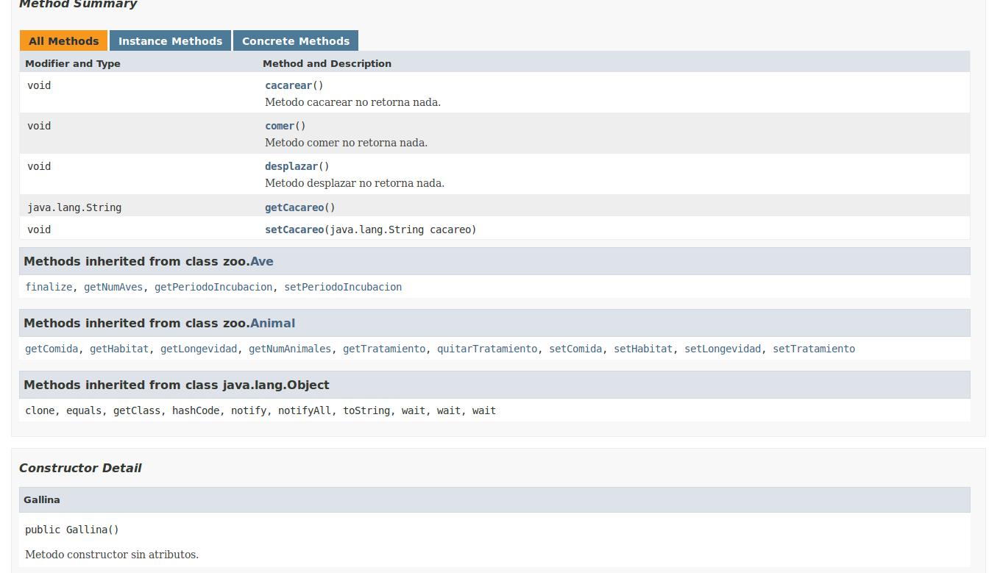
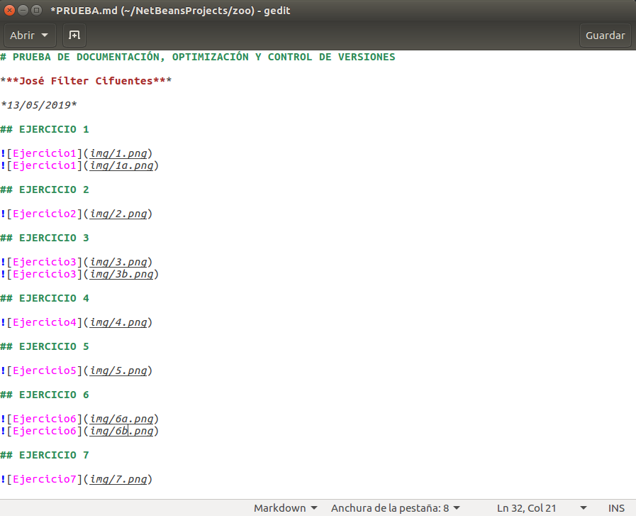
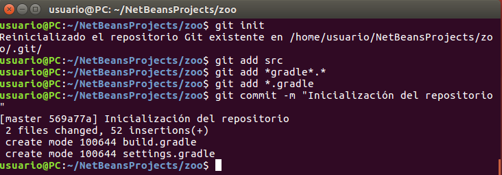
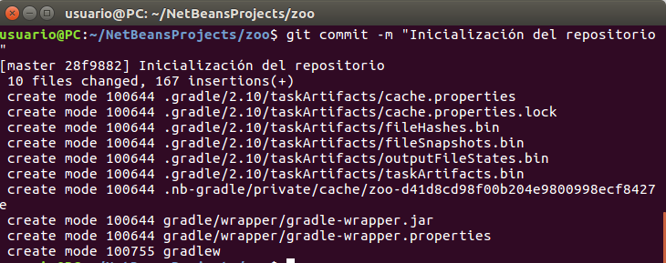
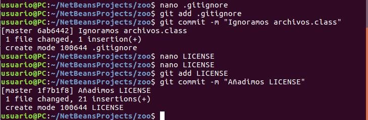
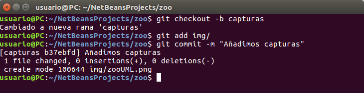
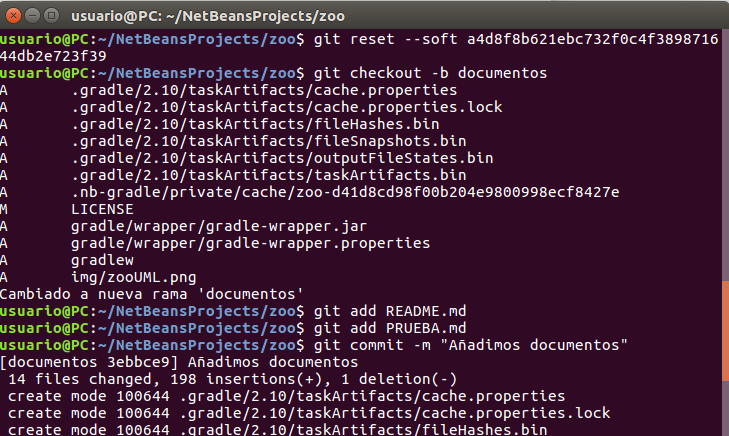
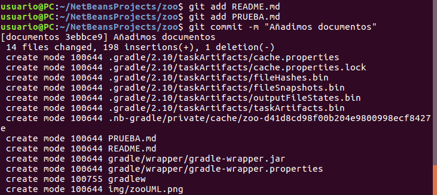
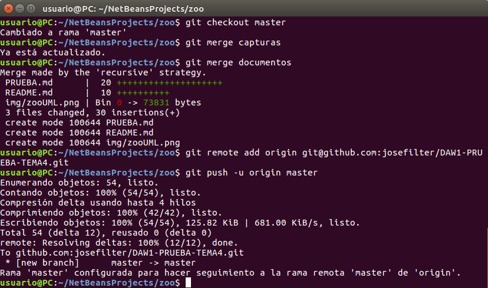

# PRUEBA DE DOCUMENTACIÓN, OPTIMIZACIÓN Y CONTROL DE VERSIONES

***José Fílter Cifuentes***

*13/05/2019*

## EJERCICIO 1

## EJERCICIO 2

## EJERCICIO 3

## EJERCICIO 4

## EJERCICIO 5

## EJERCICIO 6

## EJERCICIO 7

